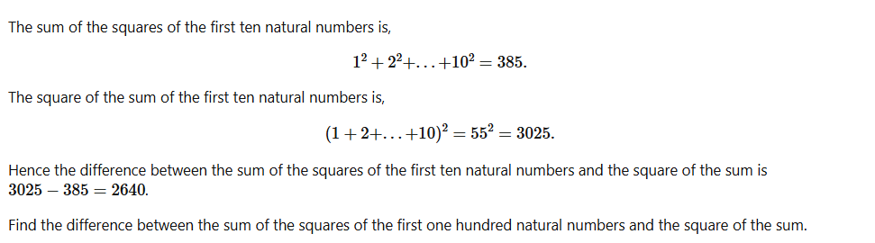
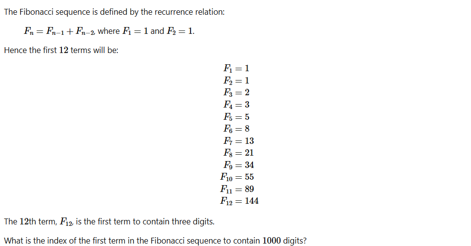

# Функциональное программирование Лабораторная рабона №1

## 6-я проблема эйлера
### Условие(взято с https://projecteuler.net/archives)

Наша задача найти разницу между квадратом суммы натуральных чисел от 1 до 100 и суммой квадратов тех же чисел

### Решение
Решение представленно в директории src/Problem6. Для решения задач использовались следующие подходы:
1. монолитные реализации с использованием:
   - хвостовой рекурсии(TailRecursion.fs);
   - рекурсии (SimpleRecursion.fs);
2. модульной реализации, где явно разделена генерация последовательности и свёртка (Generative.fs);
3. генерация последовательности при помощи отображения (Map.fs);
4. работа со спец. синтаксисом для циклов (Cycle.fs);
5. работа с бесконечными списками для языков(EndlessList.fs)
6. реализация на python для сравнения(Realization.py).

## 25-я проблема эйлера
### Условие(взято с https://projecteuler.net/archives)

Наша задача найти индекс первого числа фибоначчи, содержащего 1000 цифр

### Решение
Решение представленно в директории src/Problem6. Для решения задач использовались следующие подходы:
1. монолитные реализации с использованием:
   - хвостовой рекурсии(TailRecursion.fs);
   - рекурсии (SimpleRecursion.fs);
2. модульной реализации, где явно разделена генерация последовательности и свёртка (Generative.fs);
3. генерация последовательности при помощи отображения (Map.fs);
4. работа со спец. синтаксисом для циклов (Cycle.fs);
5. работа с бесконечными списками для языков(EndlessList.fs)
6. реализация на python для сравнения(Realization.py).
## Тесты
Тесты представленны в tests/... Для каждой проблемы эйлера конкретные проверки представлены в файле Tests.fs
## Вывод
В процессе выполнения данной лабораторной работы я познакомился с разными механизмами функционального программирования и применил их на практике. Так как эта лабораторная работа стала для меня практически первым знакомством с языком F#, я узнал много нового о нем, но самым интересным мне показалось многообразие способов передачи аргументов в функцию, такие как просто передача, передача через конвеер и даже отсутствие нескольких аргументов, что дает возможность получить на выходе не значение, а еще одну функцию 
